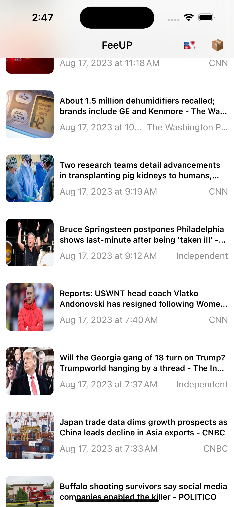
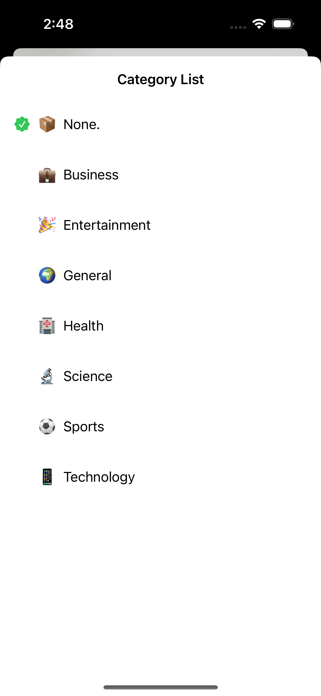
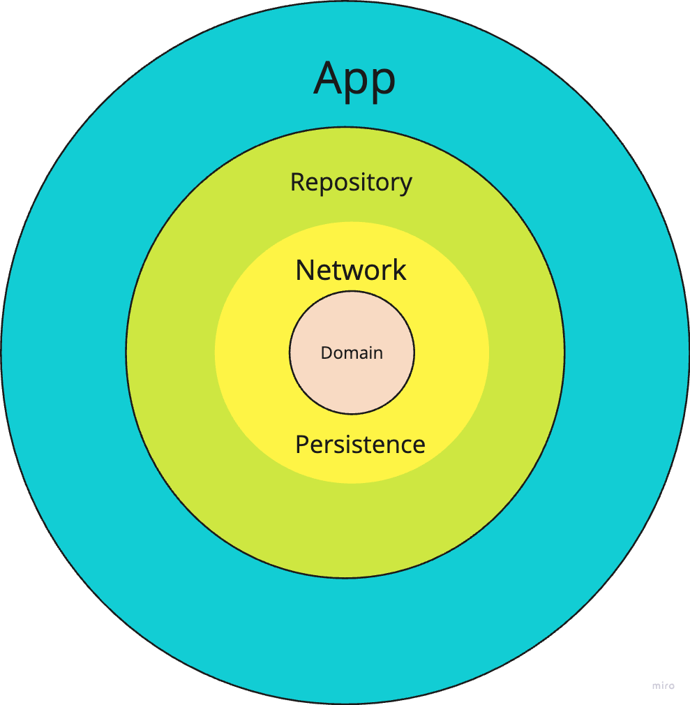

# FeeUP

This is a sample project showcasing the latest news, implemented using pure Swift and SwiftUI.

## Table of Contents
- [Features](#features)
- [Architecture](#architecture)
- [Installation](#installation)
- [Usage](#usage)
- [Contact](#contact)

## Features

  
  
  

You can view the latest news and filter them by categories, countries, or even search among news. Additionally, you can bookmark news articles.

Future features:
- [ ] Bookmark Tab
- [ ] Show News Source View
- [ ] Display Related News

## Architecture

The Clean Architecture is used to separate [Modules](#modules), with the [Presentation Layer](#mvvm) parent handling presentation.

### [Dependencies](./FeeUp/FeeUp/AppDependencies/)
An `AppDependencyEnvironmentKey` environment key is implemented for injecting dependencies into views, making it easier to access them within views. While using a `Factory` or `Swinject` for dependency injection and service location might be a better approach, this project's size makes the current method acceptable.

## MVVM:
Why MVVM? While other options (VIP, Clean, TCA) exist, we opted for an architecture that is both sample and useful and aligns with SwiftUI. For applications where data flow is crucial, architectures that handle state with a single source of truth, such as TCA or Redux, might be more suitable.

### Module Directory
The `Module` directory within the `App` directory contains 4 modules:
- [FeedList](./FeeUp/FeeUp/Modules/FeedList/): Handles the list of news for the first page.
- [FeedDetail](./FeeUp/FeeUp/Modules/FeedDetail/): Displays the details of a news article, allowing you to bookmark it.
- [CountryList](./FeeUp/FeeUp/Modules/CountryList/): Displays a list of countries for news filtering.
- [CategoryList](./FeeUp/FeeUp/Modules/CategoryList/): Displays a list of categories for news filtering.

### Module Structure
Each module comprises 3 files:
- *View: Handles the view and interfaces, implemented using SwiftUI. It references a viewModel for logic handling.
- *ViewModel: Contains a protocol and a conforming class used within the View.
- *[NameOfTheModule]: This package contains all the requirements of the module, such as State, Action, Destination, and even some extensions on the Domain modules.

## Modules:
- [ ] [Domain](/FeeUp/LocalPackages/Packages/Sources/Domain/README.md)
- [ ] [Network](/FeeUp/LocalPackages/Packages/Sources/Network/README.md)
- [ ] [API](/FeeUp/LocalPackages/Packages/Sources/API/README.md)
- [ ] [Persistence](/FeeUp/LocalPackages/Packages/Sources/Persistence/README.md)
- [ ] [Repository](/FeeUp/LocalPackages/Packages/Sources/Repository/README.md)
- [ ] [Mocks]([Repository](/FeeUp/LocalPackages/Packages/Sources/Mock/README.md))

## Installation
Use Xcode 14.3 and run the `FeeUp/FeeUp.xcodeproj`.

> For Run tests, there is [Test-Plan](AppTestPlan.xctestplan)  just need to select and use `command` + `U` to all test targets run and see the code-coverage

## Dependencies
- KingFisher: For loading remote images (SDWEBImage was another choice, but this repo is more up-to-date).
- SwiftyMocky: For mocking protocols and using them in test targets to provide and verify methods and properties.

## Contact

Email: Amir.ardalanuk@gmail.com
